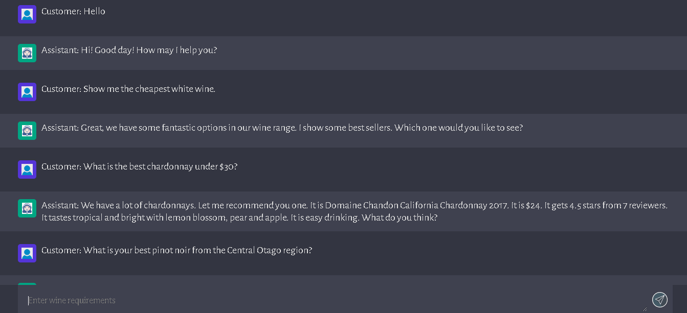
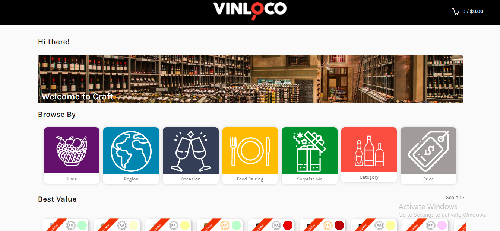
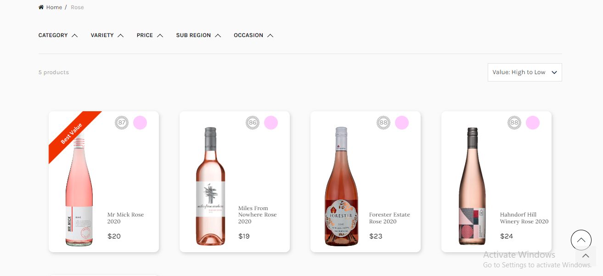

# Wine Service(ChatGPT) Client

> This Chatbot helps customers to select proper wine as they wish.

## Table of Contents

- [General Info](#general-information)
- [Technologies Used](#technologies-used)
- [Features](#features)
- [Screenshots](#screenshots)
- [Setup](#setup)
- [Project Status](#project-status)
- [Room for Improvement](#room-for-improvement)
- [Acknowledgements](#acknowledgements)
- [Contact](#contact)

## General Information

- This is customer wine service project.
- Has to be combined with server project
- Autochat with customers by using wine information of shop,
- The reason why I undertook it is because of strong interest on OpenAI,

## Technologies Used

- Tech 1 - OpenAI API
- Tech 2 - Vanilla
- Tech 3 - JavaScript

## Features

List the ready features here:

- Autochat
- Simple Chat UI
- Imitation of ChatGPT Sample

## Screenshots

<!-- If you have screenshots you'd like to share, include them here. -->

## Setup

Requires Node.js to be installed.
Need .env file which OpenAI API_KEY is stored. That is located in /server directory.

Go into /client direcotry and run `npm run dev` CLI command.
Go into /server directory and run `npm run server` CLI command.

## Project Status

Project is: _in progress_

## Room for Improvement

These are areas i believe need improvement / could be improved. Also added TODOs for future development.

Room for improvement:

- AI theory
- OpenAI API integration
- Node.js modules

To do:

- Flexible UI
- Validation

## Acknowledgements

Give credit here.

- This project was inspired by Valentyn.
- This project was based on [this tutorial](https://platform.openai.com/docs/).
- Many thanks to Valentyn.

## Contact

Created by [Bohdan](https://softdev629.github.io) - feel free to contact me!
